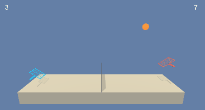
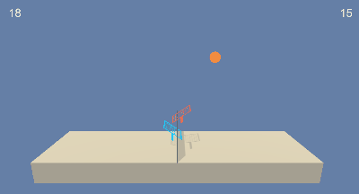
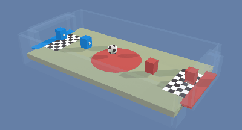

[//]: # "Image References"

[image2]: https://user-images.githubusercontent.com/10624937/42135622-e55fb586-7d12-11e8-8a54-3c31da15a90a.gif "Soccer"


# Collaboration and Competition

### Introduction

In this project, multiple agents are trained to interact in two different environments whereas the action space continuous is both of them. The agents must learn to collaborate and compete at the same time in order to maximize their expected rewards.

### Tennis

The first environment is called *Tennis*. Two agents are tasked to control a separate tennis rackets in such a way that they can pass the ball between them as many times as possible. If an agent hits the ball over the net, it receives a reward of +0.1.  If an agent lets a ball hit the ground or hits the ball out of bounds, it receives a reward of -0.01.  Thus, the goal of each agent is to collaborate with each other and keep the ball in play for as long as possible.

|      Initial (random) policy:       |      Learned policy (MADDPG):       |
| :---------------------------------: | :---------------------------------: |
|  |  |

The observation space consists of 8 variables corresponding to the position and velo city of the ball and racket. Each agent receives its own, local observation.  Two continuous actions are available, corresponding to movement toward (or away from) the net, and jumping. In order to solve the environment, the agents must get an average score of +0.5 over 100 consecutive episodes, after taking the maximum over both agents. 

### Soccer

The second environment is called *Soccer*. In this environment there are 4 agents grouped in two teams. The reward function is constructed as follows

- (1 - `accumulated time penalty`) When ball enters opponent's goal `accumulated time penalty` is incremented by (1 / `MaxStep`) every fixed update and is reset to 0 at the beginning of an episode.
- -1 When ball enters team's goal.

 Thus the goal of each team is to collaboratively and competitively get the ball into the opponent's goal while preventing the ball from entering it's own goal.

|      Initial (random) policy:       |             Learned policy:             |
| :---------------------------------: | :-------------------------------------: |
|  | TBD! |

The observation space consists of 336 variables corresponding to 11 ray-casts forward distributed over 120 degrees and 3 ray-casts backward distributed over 90 degrees each detecting 6 possible object types, along with the object's distance. The forward ray-casts contribute 264 state dimensions and backward 72 state dimensions over three observation stacks. The action space has 3 continuous dimensions corresponding to forward, backward, sideways movement, as well as rotation.

### Getting Started

1. Install [Docker](https://docs.docker.com/get-docker/)

2. If you want to log the training process, create a [wandb](https://wandb.ai/site) account

3. Replace the `<API-KEY>` tag in the `docker-compose.yml` file with your wandb api key

4. Start the training with 

   ``` bash
   # train a maddpg agent in tennis environment
   docker-compose up train_tennis_maddpg
   # train a maddpg agent in soccer environment
   docker-compose up train_soccer_maddpg
   ```

If you want to visually watch a trained agent interacting with the environment, you can download the required files at

##### Tennis:

- Linux: [click here](https://s3-us-west-1.amazonaws.com/udacity-drlnd/P3/Tennis/Tennis_Linux.zip)
- Mac OSX: [click here](https://s3-us-west-1.amazonaws.com/udacity-drlnd/P3/Tennis/Tennis.app.zip)
- Windows (32-bit): [click here](https://s3-us-west-1.amazonaws.com/udacity-drlnd/P3/Tennis/Tennis_Windows_x86.zip)
- Windows (64-bit): [click here](https://s3-us-west-1.amazonaws.com/udacity-drlnd/P3/Tennis/Tennis_Windows_x86_64.zip)

##### Soccer:

- Linux: [click here](https://s3-us-west-1.amazonaws.com/udacity-drlnd/P3/Soccer/Soccer_Linux.zip)
- Mac OSX: [click here](https://s3-us-west-1.amazonaws.com/udacity-drlnd/P3/Soccer/Soccer.app.zip)
- Windows (32-bit): [click here](https://s3-us-west-1.amazonaws.com/udacity-drlnd/P3/Soccer/Soccer_Windows_x86.zip)
- Windows (64-bit): [click here](https://s3-us-west-1.amazonaws.com/udacity-drlnd/P3/Soccer/Soccer_Windows_x86_64.zip)

Once that the visual environments have been downloaded, you can follow the instructions in the notebooks `Watch_Tennis.ipynb` or `Wach_Soccer.ipynb`.
