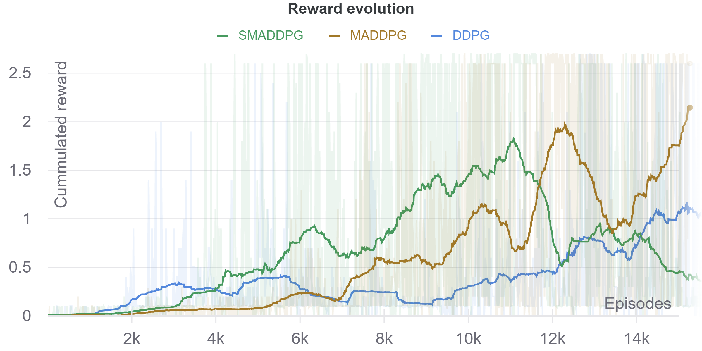

# Report

In order to solve the *Tennis* environment,  a DDPG [1] based as well as two MADDPG[2] based agents were trained. These two algorithms were choosen because of the usage of DDPG in the previous projects and its easy MADDPG extension to a multi agent environment. The MADDPG algorithm was used with two special configurations. Once it was used to train two individual agents to cooperatively play tennis [MADDPG]. Inspired by the hint of the project instructors it was then also used to train only a single agent. This is very similar to plain DDPG but in this case the critic received the full state of the environment and not just the local observations. Such a setting enables decentralized actor, centralized critic learning through self play in a *stationary* environment [SMADDPG].

We cann see that all agents were able to solve the environment. Both variants of the MADDPG algorithm are able to solve it faster than plain DDPG. The SMADDPG seems to be the fastest of the three which can be explained by its higher sample efficiency over MADDPG and environment stationarity over DDPG. For further details see the dedicated sections below

### DDPG: Deep deterministic policy gradients agent

Using the DDPG algorithm proposed by [1] the agent reached an average reward of 0.5 after 12'000 episodes. The reward increased even further to a value of ~1 were the training was stopped due to time constraints.

The following hyperparameters were used to train this agent:

| Hyperparameter                            | Value             |
| ----------------------------------------- | ----------------- |
| Replay buffer size                        | $10^6$            |
| Minimal replay buffer size                | $10^3$            |
| Batch size                                | $64$              |
| $\tau$ (soft update)                      | $10^{-3}$         |
| Timestep update interval                  | $32$              |
| $\epsilon$ Initial value                  | $1$               |
| $\epsilon$ decay (multiplicative)         | $.9995$           |
| Nr. of mini batch updates per update step | $16$              |
| $\gamma$                                  | $.99$             |
| $\alpha$ learning rate                    | $5 \cdot 10^{-4}$ |
| Optimizer                                 | Adam              |

#### Network architectures

| Network | Configuration                                                |
| ------- | :----------------------------------------------------------- |
| Actor   | MLP ([24, 128, 64, 2]) Activation function hidden layer: *ReLU* Activation function last layer: *TanH* The outputs are interpreted as (argmax) actions. |
| Critic  | MLP ([24 + 2, 128, 64, 1]) Activation function hidden layer: *ReLU* Activation function last layer: *Linear* |

### MADDPG: Multi-agent deep deterministic policy gradients agent

Using the MADDPG algorithm proposed by [2] the agents reached an average reward of 0.5 after 8'000 episodes. The reward increased even further to a value of ~2 but dropped again shortly afterwards.

The following hyperparameters were used to train this agent:

| Hyperparameter                            | Value            |
| ----------------------------------------- | ---------------- |
| Replay buffer size                        | $10^6$           |
| Minimal replay buffer size                | $10^3$           |
| Batch size                                | $64$             |
| $\tau$ (soft update)                      | $10^{-3}$        |
| Timestep update interval                  | $32$             |
| $\epsilon$ Initial value                  | $1$              |
| $\epsilon$ decay (multiplicative)         | $.9995$          |
| Nr. of mini batch updates per update step | $16$             |
| $\gamma$                                  | $.99$            |
| $\alpha$ learning rate                    | $5\cdot 10^{-4}$ |
| Optimizer                                 | Adam             |

#### Network architectures

| Network | Configuration                                                |
| ------- | :----------------------------------------------------------- |
| Actor   | MLP ([24, 128, 64, 2]) Activation function hidden layer: *ReLU* Activation function last layer: *TanH* The outputs are interpreted as (argmax) actions. |
| Critic  | MLP ([2*(24 + 2), 128, 64, 1]) Activation function hidden layer: *ReLU* Activation function last layer: *Linear* |

### SMADDPG: Single multi-agent deep deterministic policy gradients agent

Using the (S)MADDPG algorithm proposed by [2] and the adaptions described at the beginning of the report the agent reached an average reward of 0.5 after 5'000 episodes. The reward increased even further to a value of ~1.8 but dropped again shortly afterwards.

The following hyperparameters were used to train this agent:

| Hyperparameter                            | Value            |
| ----------------------------------------- | ---------------- |
| Replay buffer size                        | $10^6$           |
| Minimal replay buffer size                | $10^3$           |
| Batch size                                | $64$             |
| $\tau$ (soft update)                      | $10^{-3}$        |
| Timestep update interval                  | $32$             |
| $\epsilon$ Initial value                  | $1$              |
| $\epsilon$ decay (multiplicative)         | $.9995$          |
| Nr. of mini batch updates per update step | $10$             |
| $\gamma$                                  | $.99$            |
| $\alpha$ learning rate                    | $5\cdot 10^{-4}$ |
| Optimizer                                 | Adam             |

#### Network architectures

| Network | Configuration                                                |
| ------- | :----------------------------------------------------------- |
| Actor   | MLP ([24, 128, 64, 2]) Activation function hidden layer: *ReLU* Activation function last layer: *TanH* The outputs are interpreted as (argmax) actions. |
| Critic  | MLP ([2*(24 + 2)+ 4, 128, 64, 1]) Activation function hidden layer: *ReLU* Activation function last layer: *Linear* |

## Further work

In this project the DDPG and its multi agent extension MADDPG were implemented and experimented with. Apart from the documented parameters only little hyperparameter exploration was done because most of the time was spent on implementing and testing the algorithms. An extensive hyperparameter grid search could yield a more robust learning process.

In the *Tennis* environment we could observe the expected difference between the algorithms in terms of convergence speed. A next step could be to implement a on-policy multi agent algorithm like MAPPO [3]. Looking at the performance of the algorithms in the *Tennis* environment it would be very intriguing to apply them to another, harder task such as the *Soccer* environment and compare their performances yet again.

### References

[1] https://arxiv.org/abs/1509.02971

[2] https://arxiv.org/abs/1706.02275

[3] https://arxiv.org/abs/2103.01955